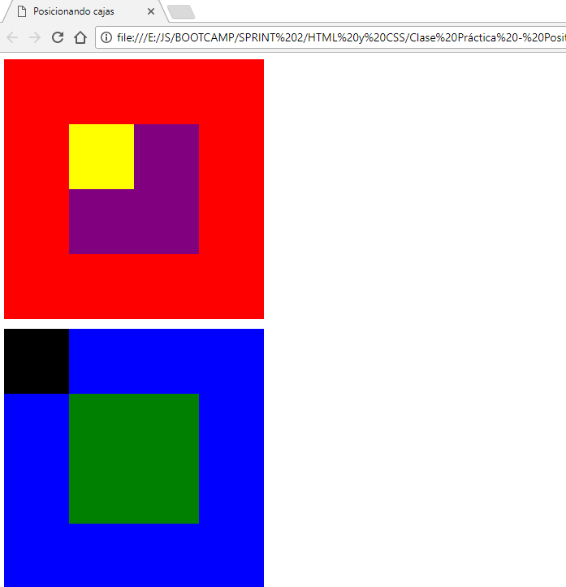

## Posicionando cajas

#### Descripción:
Este repositorio contiene el dibujo de una cancha de fútbol realizado con la propiedad position de CSS.

El dibujo final se ve así en el navegador:

  

#### Herramientas utilizadas:
* HTML
* CSS
